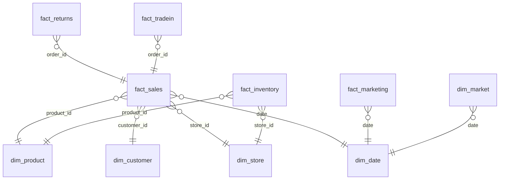

# 📱 iPhone Sales Analytics — End-to-End BI Project

**Excel/Power Query → PostgreSQL (SQL) → Power BI**

A full-stack business intelligence project that turns raw, messy iPhone sales data into a decision-ready 4-page Power BI dashboard — built to mirror how a real MIS/Data Analytics team works: clean the data, model it relationally, then visualize it for stakeholders.

> 📌 Built by **Kavan Thakar** — MIS Executive | Power BI · Looker Studio · Tableau · Excel · SQL

---

## 🎯 Why this project

Most portfolio dashboards start from a single clean CSV. This one doesn't. It starts from **12 separate, real-world-style datasets** (sales transactions, product master, customer master, store master, pricing & discounts, trade-ins, marketing campaigns, inventory, returns, warranty, and competitor market share) — the same kind of scattered data an MIS analyst actually gets handed — and turns it into one governed, queryable model.

## 🏗️ Architecture

```
Raw multi-source data (Excel)
        │
        ▼
 Power Query  →  cleaning, merging, shaping
        │
        ▼
 PostgreSQL (SQL)  →  relational modeling, star schema
        │
        ▼
   Power BI  →  data model + DAX measures + 4-page dashboard
```

**Star schema data model** (5 fact tables, 5 dimension tables):



## 📊 The Dashboard — 4 Pages

| Page | What it answers |
|---|---|
| **Executive Overview** | Revenue, orders, avg. price, discount %, return rate at a glance — with revenue trend, sales by product series, sales by country, marketing spend by channel, and Apple vs. Samsung/OnePlus/Google market share |
| **Sales & Product Analysis** | Which series and storage tiers drive revenue and units; revenue vs. discount relationship across products (scatter analysis); country-level performance |
| **Customer & Marketing Analysis** | Cost per lead, CAC, lead → conversion funnel by channel; customer segment mix; new vs. existing Apple customers |
| **Inventory & Returns** | Closing stock trend, stock received, stock by city, return rate, trade-in participation |

*(Add 1–2 screenshots of each page here before publishing — visuals are what get a recruiter to stop scrolling.)*

## 🧮 Key DAX Measures (30+)

A sample of the measure library behind the visuals — not just SUMs, but ratio and funnel metrics an actual business would track:

```DAX
Return Rate = DIVIDE([Return Orders], [Total Orders], 0)

CAC = DIVIDE([Marketing Spend], [Conversions], 0)

Trade-in Participation % =
DIVIDE(
    CALCULATE(DISTINCTCOUNT('fact_sales'[order_id]), 'fact_tradein'[order_id] <> BLANK()),
    [Total Orders]
)

Lead Conversion % = DIVIDE([Conversions], [Leads], 0)
```

Full list covers revenue, pricing, discounting, market share, marketing funnel, inventory, returns, and trade-in metrics.

## 🛠️ Tech Stack

`Excel` `Power Query (M)` `PostgreSQL` `SQL` `Power BI` `DAX` `Star Schema Data Modeling`

## 📁 Repo Structure 

```
iphone-sales-analytics/
├── README.md
├── data/                  # source datasets (or sample/synthetic versions)
├── sql/                   # table creation + load scripts
├── powerbi/
│   └── apple_Sales_Dashboard.pbit
└── screenshots/           # dashboard page images for this README
```

## 🚀 How to Explore

1. Clone the repo
2. Open `powerbi/apple_Sales_Dashboard.pbit` in Power BI Desktop
3. Point it at the included PostgreSQL database (or the sample data in `/data`)
4. Explore the 4 report pages via the tabs at the top

## 🔗 Connect

If you're hiring for an MIS / Data Analyst / BI role, I'd love to talk — reach out via [www.linkedin.com/in/kavan-thakar-32b27b400](#) or open an issue on this repo.

---

⭐ If this project is useful as a reference for your own SQL → Power BI pipeline, consider starring the repo.
